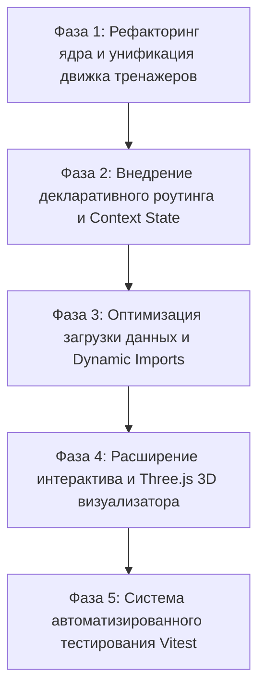

# Архитектурный гайд, правила разработки и BDUF Роадмап проекта S_Chem_Portal

Данный документ представляет собой полное руководство по текущему устройству веб-портала **S_Chem_Portal**, правила чистого кода для автономных агентных систем программирования, а также Big Design Up Front (BDUF) план поэтапного развития проекта.

---

## Часть 1. Гайд по текущей реализации проекта

### 1.1. Обзор проекта и технологического стека
**S_Chem_Portal** — образовательная интерактивная платформа для подготовки к экзаменам (ЕГЭ, ОГЭ, ВсОШ, ДВИ МГУ) и углубленного изучения химии.

**Стек технологий:**
- **Core / Framework**: React 19.2, TypeScript 6.0, Vite 8.1
- **Styling**: Tailwind CSS v4 (PostCSS/Vite интеграция)
- **UI Animation & Icons**: Framer Motion 12, Lucide React
- **Scientific & Math Rendering**: KaTeX 0.18 (математические и химические уравнения), Canvas Confetti
- **3D Graphics**: Three.js 0.185 (визуализация молекул и химических структур)
- **Code Quality & Build**: Oxlint 1.71, TypeScript Compiler (`tsc -b`)

---

### 1.2. Архитектура и структура директорий
Структура исходного кода в `src/`:

```
src/
├── App.tsx                        # Корневой компонент (переключение режимов отображения viewMode)
├── main.tsx                       # Точка входа React DOM
├── index.css                      # Глобальные стили и импорт Tailwind
├── assets/                        # Изображения и статические ресурсы
├── types/                         # Определение всех интерфейсов TypeScript
│   ├── index.ts                   # Базовые типы (Teacher, Course, Molecule, ReactionTask)
│   ├── skillMap.ts                # Типы Карты навыков (SkillNode, BloomLevel, GradeLevel, SkillBranch)
│   └── trainer.ts                 # Типы тренажеров (OvrTask, Inorganic31Task, SingleReactionTask)
├── services/                      # Сервисный слой и персистентность
│   ├── trainerStorage.ts          # Сервис сохранения прогресса решений в localStorage
│   └── skillMapService.ts         # Фильтрация, расчет статистики и поиск связей в карте навыков
├── hooks/                         # Пользовательские хуки React
│   └── useSkillMap.ts             # Управление состоянием фильтров и выбора узлов карты навыков
├── utils/                         # Вспомогательные утилиты
│   └── threeMoleculeRenderer.ts   # Построение 3D молекул в Three.js (атомы и связи)
├── data/                          # Моковые наборы данных (задачи и метаданные)
│   ├── inorganic31Tasks.ts        # База задач №31 (Неорганическая химия, 89 КБ)
│   ├── ovrTasks.ts                # База задач №29 (ОВР с электронным балансом, 39 КБ)
│   ├── reactionsNPTasks.ts        # База цепочек/реакций неорганической химии (66 КБ)
│   ├── skillsData.ts              # Граф образовательных навыков (47 КБ)
│   ├── trainersCatalog.ts         # Каталог доступных модулей тренажеров
│   ├── molecules.ts               # Данные молекул для 3D просмотра
│   └── courses.ts, teachers.ts... # Справочные данные лендинга
└── components/                    # UI-компоненты
    ├── layout/                    # Header, Footer, AnnouncementBar
    ├── sections/                  # Секции главного лендинга (Hero, Courses, Teachers, FAQ, etc.)
    ├── interactive/               # 3D MoleculeViewer, ReactionSimulator, SkillRoadmap
    ├── scientific/                # ChemFormula (Рендеринг формул через KaTeX)
    ├── skillMap/                  # Интерактивная Карта Навыков (Canvas, Matrix, Timeline, DetailModal)
    └── trainers/                  # Модуль тренажеров
        ├── GenericTrainerContainer.tsx  # Каркас страницы тренажера (Header + Sidebar + Adapter)
        ├── TrainersCatalogPage.tsx     # Каталог выбора тренажеров
        ├── OvrTrainer.tsx              # Конкретный тренажер ОВР (№29)
        ├── Inorganic31Trainer.tsx      # Конкретный тренажер Неорганики (№31)
        ├── ReactionsTrainer.tsx        # Конкретный тренажер Реакций (№30)
        ├── adapters/                   # Адаптеры интерфейса ввода и проверки
        │   ├── OvrTaskAdapter.tsx              # Адаптер ввода коэффициентов и баланса ОВР
        │   ├── Inorganic31TaskAdapter.tsx      # Адаптер ввода 4 реакций №31
        │   └── SingleReactionTaskAdapter.tsx   # Адаптер одной реакции
        └── common/                     # Общие компоненты тренажеров (TaskSidebar, TrainerHeader, badges)
```

---

### 1.3. Основные модули и функциональные цепочки

#### 1. Интерактивная Карта Навыков (`SkillMap`)
- **Компоненты**: `SkillMapPage`, `SkillMapCanvas`, `SkillMatrixView`, `SkillTimelineView`, `SkillDetailModal`.
- **Логика**: Позволяет визуализировать граф освоения химии по классам (8–11, ВУЗ), разделам (неорганика, органика, физхимия и т.д.) и уровням Блума.
- **Связь с тренажерами**: Из модального окна узла навыка (`SkillDetailModal`) студент может сразу перейти к соответствующему тренажеру по `trainerTopicId`.

#### 2. Модуль Интерактивных Тренажеров (`Trainers Engine`)
- **Контейнер**: `GenericTrainerContainer` предоставляет единую структуру: заголовок с прогресс-баром, боковую панель задач (`TaskSidebar`), фильтрацию по подтемам (`SubtopicFilterBar`) и сам адаптер задачи.
- **Адаптеры**:
  - `OvrTaskAdapter`: Проверка коэффициентов реакции ОВР + проверка электронного баланса (окислитель/восстановитель, отдано/принято электронов).
  - `Inorganic31TaskAdapter`: Проверка 4 независимых химических уравнений в рамках одного описания эксперимента.
  - `SingleReactionTaskAdapter`: Универсальный ввод коэффициентов для одиночной химической реакции.
- **Хранение прогресса**: `TrainerStorageService` сохраняет статусы решения задач (`solved`, `score`) в `localStorage` пользователя.

#### 3. 3D Визуализатор Молекул (`MoleculeViewer3D`)
- Рендерит атомы в виде 3D-сфер (цвета по стандарту CPK: H — белый, C — серый, O — красный, N — синий) и химические связи в виде цилиндров с использованием `Three.js` и утилиты `threeMoleculeRenderer.ts`.

---

### 1.4. Текущие архитектурные проблемы (Technical Debt)

1. **Отсутствие декларативного роутинга**:
   - Переключение экранов производится через единственный `useState<ViewMode>` в `App.tsx`. Нельзя поделиться прямой ссылкой на конкретную задачу или карту навыков.
2. **Дублирование кода в адаптерах тренажеров**:
   - `OvrTaskAdapter`, `Inorganic31TaskAdapter` и `SingleReactionTaskAdapter` содержит повторяющуюся логику парсинга и сверки коэффициентов, управления подсказками, состоянием ввода и показа правильного ответа.
3. **Монолитные наборы данных в бандле**:
   - Файлы `inorganic31Tasks.ts` (89 КБ), `reactionsNPTasks.ts` (66 КБ) и `skillsData.ts` (47 КБ) импортируются напрямую в код, увеличивая размер первого чанка JS.
4. **Отсутствие автотестов**:
   - В проекте нет настроенной тестовой среды (Vitest / Jest), алгоритмы проверки реакций не покрыты unit-тестами.

---

## Часть 2. Правила дальнейшей разработки (DRY, SOLID, KISS, YAGNI)

Для работы агентных AI-систем в данном проекте вводятся **строгие правила**, обязательные к исполнению без исключений.

### 2.1. Принцип DRY (Don't Repeat Yourself)
1. **Унификация ввода коэффициентов**: Запрещено создавать новые компоненты ввода коэффициентов. Весь ввод реакций обязан использовать переиспользуемый компонент `CoefficientInputGroup`.
2. **Единый сервис проверки уравнений**: Алгоритмы проверки равенства реагентов и продуктов должны быть вынесены в `src/core/chemistry/equationEvaluator.ts`.
3. **Унифицированная работа с LocalStorage**: Все тренажеры должны использовать `TrainerStorageService` без прямого вызова `localStorage.getItem/setItem`.

### 2.2. Принцип SOLID
1. **Single Responsibility Principle (SRP)**:
   - UI-компоненты отвечает **только** за рендеринг. Логика подсчета баллов, проверки химического баланса и фильтрации выносится в сервисы или хуки.
2. **Open/Closed Principle (OCP)**:
   - Модуль тренажеров расширяется добавлением новых конфигураций типов задач в реестр `TaskRegistry`, без модификации `GenericTrainerContainer`.
3. **Liskov Substitution Principle (LSP)**:
   - Все адаптеры задач должны имплементировать единый интерфейс `ITaskAdapterProps<TTask>`.
4. **Interface Segregation Principle (ISP)**:
   - Разделять массивные типы. Вместо одной гигантской задачи создаются базовый `BaseTask` и специфичные расширения: `IEquationTask`, `IElectronicBalanceTask`.
5. **Dependency Inversion Principle (DIP)**:
   - Компоненты зависят от абстракций интерфейсов данных, а не от прямых импортов конкретных JSON/TS файлов. Загрузка данных осуществляется через `ITaskRepository`.

### 2.3. Принципы KISS и YAGNI
1. **KISS (Keep It Simple, Stupid)**:
   - Не добавлять сложные внешние менеджеры состояния (Redux, MobX), если задачу можно решить через React Context или `useSyncExternalStore`.
   - Использовать понятную древовидную структуризацию компонентов.
2. **YAGNI (You Aren't Gonna Need It)**:
   - Не создавать backend-сервер или GraphQL API, пока все задачи могут эффективно отдаваться через статичные JSON с клиентским кэшированием в IndexedDB.
   - Не усложнять систему аутентификации до тех пор, пока не появится личный кабинет с БД.

### 2.4. Специфический протокол выполнения для AI-агентов
- **Инвариантность типов**: Любое изменение в типах (`src/types/`) требует предварительной проверки всех мест использования с помощью `grep_search`.
- **Контроль сборки**: После каждого этапа модификации кода агент **обязан** выполнять `npm run build` для проверки отсутствия ошибок TypeScript.
- **Изоляция изменений**: Изменения должны вноситься пошагово, строго в рамках текущей фазы роадмапа.

### 2.5. Создание учебных тем (study/topics)

Создание, рефакторинг и интеграция учебных тем регулируются отдельным модульным стандартом — [`docs/topic-standard/`](docs/topic-standard/):

- [`00-PIPELINE.md`](docs/topic-standard/00-PIPELINE.md) — конвейер из трёх ролей, пошаговый чек-лист, реестр эталонов;
- [`10-ARCHITECTURE.md`](docs/topic-standard/10-ARCHITECTURE.md) — модульная структура темы, точки регистрации, DRY-каталог компонентов;
- [`20-RENDERING.md`](docs/topic-standard/20-RENDERING.md) — рендеринг формул (KaTeX/`ChemFormula`), 2D-схемы, 3D-модели;
- [`30-DESIGN.md`](docs/topic-standard/30-DESIGN.md) — дизайн-система тем;
- [`topic-types/`](docs/topic-standard/topic-types/) — семейные профили: «Химия элементов» (ХЭ-NN, блок `elements-chemistry`) и «Общая химия» (ОХ-NN, блок `general-chemistry`).

Ролевые агенты конвейера (вердикты блокирующие): [`.qwen/agents/topic-verifier.md`](.qwen/agents/topic-verifier.md) — научная верификация; [`.qwen/agents/topic-proofreader.md`](.qwen/agents/topic-proofreader.md) — постпроверка. Уникальные детали и отклонения каждой темы фиксируются в её паспорте [`docs/topic-passports/<slug>.md`](docs/topic-passports/); паспорт читается до любых правок темы. Краткая сводка и маршрутизация — в [`QWEN.md`](QWEN.md).

---

## Часть 3. BDUF Роадмап проекта (Big Design Up Front Roadmap)

Роадмап разбита на 5 независимых последовательных фаз. Каждая фаза полностью формализована и содержит техническую спецификацию BDUF, список файлов и готовую директиву для запуска AI-агента.



---

### Фаза 1: Рефакторинг ядра и унификация архитектуры тренажеров

#### 🎯 Цель
Создать единый модуль ядра тренажеров (`src/core/trainer/`), устранить дублирование кода между `OvrTaskAdapter`, `Inorganic31TaskAdapter` и `SingleReactionTaskAdapter`.

#### 📋 Прекондшины
Текущее состояние репозитория.

#### 🏗️ Архитектурный проект (BDUF)
1. Создать абстракцию `useTaskState<T>` для управления состоянием ответа, подсказок и валидации.
2. Создать переиспользуемые UI-компоненты:
   - `InteractiveEquationForm.tsx` (отображение формулы KaTeX и полей ввода коэффициентов).
   - `TaskSolutionFeedback.tsx` (блок разбора ответа, разбалловка, кнопка "Показать решение").
3. Создать `EquationEvaluator` (`src/core/chemistry/equationEvaluator.ts`) для валидации введенных коэффициентов относительно эталона.

#### 📁 Изменения файлов
- `[NEW]` [equationEvaluator.ts](file:///f:/S_Chem_Portal/src/core/chemistry/equationEvaluator.ts)
- `[NEW]` [useTaskState.ts](file:///f:/S_Chem_Portal/src/core/trainer/hooks/useTaskState.ts)
- `[NEW]` [InteractiveEquationForm.tsx](file:///f:/S_Chem_Portal/src/core/trainer/components/InteractiveEquationForm.tsx)
- `[NEW]` [TaskSolutionFeedback.tsx](file:///f:/S_Chem_Portal/src/core/trainer/components/TaskSolutionFeedback.tsx)
- `[MODIFY]` [OvrTaskAdapter.tsx](file:///f:/S_Chem_Portal/src/components/trainers/adapters/OvrTaskAdapter.tsx)
- `[MODIFY]` [Inorganic31TaskAdapter.tsx](file:///f:/S_Chem_Portal/src/components/trainers/adapters/Inorganic31TaskAdapter.tsx)
- `[MODIFY]` [SingleReactionTaskAdapter.tsx](file:///f:/S_Chem_Portal/src/components/trainers/adapters/SingleReactionTaskAdapter.tsx)

#### ✅ Критерии приемки
1. Сокращение объема кода адаптеров в `src/components/trainers/adapters/` более чем на 40%.
2. Проект успешно собирается через `npm run build`.
3. Все 3 тренажера (ОВР, №31, Цепочки) сохраняют 100% исходного функционала и внешнего вида.

#### 🤖 AI Agent Directive (Директива для агента)
> Выполни Фазу 1 роадмапа: Выдели единый Chemistry Trainer Engine в `src/core/trainer/`. Создай хук `useTaskState` и компоненты `InteractiveEquationForm`, `TaskSolutionFeedback`. Прорефактори адаптеры `OvrTaskAdapter`, `Inorganic31TaskAdapter`, `SingleReactionTaskAdapter`, переведя их на единое ядро. Убедись, что `npm run build` проходит без ошибок.

---

### Фаза 2: Внедрение декларативного роутинга и глобального состояния

#### 🎯 Цель
Заменить условный рендеринг по `viewMode` на полноценный маршрутизатор (например, `react-router-dom` или легкий роутер / History API wrapper) и внедрить `UserProgressContext` для централизованного управления состоянием пользователя.

#### 📋 Прекондшины
Успешное выполнение Фазы 1.

#### 🏗️ Архитектурный проект (BDUF)
1. Внедрить поддержку роутинга с URL-структурой:
   - `/` — Главная страница (Hero, Courses, Teachers, FAQ)
   - `/trainers` — Каталог тренажеров
   - `/trainers/ovr` — Тренажер ОВР (№29)
   - `/trainers/inorganic-31` — Тренажер Неорганики (№31)
   - `/trainers/reactions` — Тренажер Одиночных Реакций / Цепочек
   - `/skill-map` — Интерактивная Карта Навыков
   - `/skill-map/:skillId` — Карта навыков с автоматически открытой модалкой навыка
2. Создать `UserProgressContext` (`src/context/UserProgressContext.tsx`), объединяющий прогресс всех тренажеров и карты навыков.

#### 📁 Изменения файлов
- `[NEW]` [UserProgressContext.tsx](file:///f:/S_Chem_Portal/src/context/UserProgressContext.tsx)
- `[NEW]` [router.tsx](file:///f:/S_Chem_Portal/src/routes/router.tsx)
- `[MODIFY]` [App.tsx](file:///f:/S_Chem_Portal/src/App.tsx)
- `[MODIFY]` [Header.tsx](file:///f:/S_Chem_Portal/src/components/layout/Header.tsx)
- `[MODIFY]` [SkillMapPage.tsx](file:///f:/S_Chem_Portal/src/components/skillMap/SkillMapPage.tsx)

#### ✅ Критерии приемки
1. Пользователь может перезагрузить страницу `/trainers/ovr` или `/skill-map` и остаться на том же экране.
2. Поддержка навигации кнопками браузера Назад/Вперед.
3. Прогресс решения задач сквозным образом отображается в Header и на Карте навыков.

#### 🤖 AI Agent Directive (Директива для агента)
> Выполни Фазу 2 роадмапа: Настрой роутинг приложения для поддержки прямой адресации разделов (`/trainers`, `/skill-map` и т.д.). Создай `UserProgressContext` для хранения прогресса решений и объединения его с `TrainerStorageService`. Убедись, что навигация и обновление URL работают корректно и `npm run build` проходит без ошибок.

---

### Фаза 3: Оптимизация загрузки данных и Dynamic Imports

#### 🎯 Цель
Вынести статичные тяжелые наборы данных из основного бандла в асинхронные чанки с поддержкой динамической загрузки (Code Splitting & Lazy Data Loading).

#### 📋 Прекондшины
Успешное выполнение Фазы 2.

#### 🏗️ Архитектурный проект (BDUF)
1. Вынести файлы задач из `src/data/*.ts` в `public/data/` или использовать динамические импорты `import()`.
2. Создать репозиторий `TaskRepositoryService` (`src/services/taskRepositoryService.ts`) с асинхронными методами:
   - `getOvrTasks(): Promise<OvrTask[]>`
   - `getInorganic31Tasks(): Promise<Inorganic31Task[]>`
   - `getReactionsTasks(): Promise<SingleReactionTask[]>`
   - `getSkillNodes(): Promise<SkillNode[]>`
3. Добавить индикаторы загрузки (Skeleton/Spinner) на время загрузки задач в тренажерах.

#### 📁 Изменения файлов
- `[NEW]` [taskRepositoryService.ts](file:///f:/S_Chem_Portal/src/services/taskRepositoryService.ts)
- `[MODIFY]` [inorganic31Tasks.ts](file:///f:/S_Chem_Portal/src/data/inorganic31Tasks.ts) (перевод на динамический экспорт/чанк)
- `[MODIFY]` [ovrTasks.ts](file:///f:/S_Chem_Portal/src/data/ovrTasks.ts)
- `[MODIFY]` [reactionsNPTasks.ts](file:///f:/S_Chem_Portal/src/data/reactionsNPTasks.ts)
- `[MODIFY]` [OvrTrainer.tsx](file:///f:/S_Chem_Portal/src/components/trainers/OvrTrainer.tsx)
- `[MODIFY]` [Inorganic31Trainer.tsx](file:///f:/S_Chem_Portal/src/components/trainers/Inorganic31Trainer.tsx)

#### ✅ Критерии приемки
1. Размер первичного JS-бандла уменьшен минимум на 150 КБ.
2. Страницы тренажеров показывают изящный Skeleton при первой загрузке данных.
3. Проект успешно проходит сборку `npm run build`.

#### 🤖 AI Agent Directive (Директива для агента)
> Выполни Фазу 3 роадмапа: Реализуй асинхронную динамическую загрузку тяжелых наборов данных задач через `TaskRepositoryService`. Настрой динамические импорты для `inorganic31Tasks`, `ovrTasks`, `reactionsNPTasks` и `skillsData`. Добавь состоянию тренажеров лоадеры и убедись в успешности сборки.

---

---

### Фаза 5: Система автоматизированного тестирования Vitest

#### 🎯 Цель
Обеспечить высокое качество и надежность бизнес-логики химического портала путем внедрения Vitest и покрытия тестами ключевых сервисов и эвалуаторов.

#### 📋 Прекондшины
Успешное выполнение Фаз 1–4.

#### 🏗️ Архитектурный проект (BDUF)
1. Подключить `vitest` и `@testing-library/react` в `package.json` и `vite.config.ts`.
2. Написать юнит-тесты:
   - `equationEvaluator.test.ts` — Проверка правильности расстановки коэффициентов и электронного баланса.
   - `trainerStorage.test.ts` — Проверка сохранения, загрузки и сброса прогресса в `localStorage`.
   - `skillMapService.test.ts` — Проверка фильтрации графа навыков, расчета статистики по классам и поиска пререквизитов.

#### 📁 Изменения файлов
- `[MODIFY]` [package.json](file:///f:/S_Chem_Portal/package.json)
- `[MODIFY]` [vite.config.ts](file:///f:/S_Chem_Portal/vite.config.ts)
- `[NEW]` `src/core/chemistry/__tests__/equationEvaluator.test.ts`
- `[NEW]` `src/services/__tests__/trainerStorage.test.ts`
- `[NEW]` `src/services/__tests__/skillMapService.test.ts`

#### ✅ Критерии приемки
1. Команда `npm run test` проходит успешно без единой ошибки.
2. Покрытие (coverage) core-логики проверки реакций и сервисов составляет >85%.

#### 🤖 AI Agent Directive (Директива для агента)
> Выполни Фазу 5 роадмапа: Настрой Vitest в проекте. Напиши юнит-тесты для `equationEvaluator`, `TrainerStorageService` и `SkillMapService`. Убедись, что все тесты выполняются успешно при запуске `npm run test` и проект собирается без ошибок.
